# Projeto Janeiro Branco 🤍


Este projeto é uma aplicação web completa desenvolvida em apoio à campanha **Janeiro Branco**, o mês de conscientização da saúde mental. A plataforma busca ser um canal de informação e, ao mesmo tempo, um espaço seguro e acolhedor para que pessoas possam deixar mensagens de apoio e solidariedade de forma anônima.

## 📜 Sobre a Campanha

A **Campanha Janeiro Branco** é uma iniciativa que tem o intuito de conscientizar a sociedade sobre a importância da **saúde mental**. Ela surgiu como uma resposta à necessidade de promover reflexões sobre a vida, relações, objetivos e passados, especialmente no início do ano. Criada em 2014 pelo psicólogo, palestrante e escritor mineiro Leonardo Abrahão, a campanha se consolidou como um marco no calendário brasileiro e, desde 2023, é reconhecida oficialmente como Lei Federal **(Lei 14.556/23)**.

## ✨ Funcionalidades

O projeto conta com as seguintes funcionalidades:

* **Página Informativa:** Uma página inicial que apresenta a campanha, explica a importância da campanha, seus objetivos e informações gerais sobre saúde mental.
* **Forúm de Apoio:** Uma seção dinâmica onde são exibidas todas as mensagens de apoio enviadas pelos usuários, ordenadas da mais recente para a mais antiga.
* **Formulário de Envio:** Um formulário simples e seguro para que qualquer pessoa possa enviar sua mensagem, com a opção de se identificar ou permanecer anônima.
* **Sites e Aplicativos de Apoio:** Seção onde o usuário pode encontrar sites e aplicativos de apoio e produtividade.


## 💻 Tecnologias Utilizadas

A aplicação foi construída utilizando um conjunto de tecnologias modernas, separando as responsabilidades entre o front-end, o back-end e o banco de dados.

* **Front-end (Interface do Usuário):**
    * `HTML5`: Para a estruturação semântica do conteúdo.
    * `CSS3`: Para a estilização, layout e design responsivo, seguindo a identidade visual do Agosto Lilás.

* **Back-end (Lógica do Servidor):**
    * `Python 3`: Linguagem principal para toda a lógica da aplicação.
    * `Django`: Framework de código aberto para criar o servidor web.

* **Banco de Dados:**
    * `SQLite 3`: Um banco de dados relacional baseado em arquivo, ideal para projetos de pequeno e médio porte pela sua simplicidade e por não necessitar de um servidor dedicado.

## 🚀 Como Executar o Projeto Localmente

Para rodar esta aplicação em seu ambiente de desenvolvimento, siga os passos detalhados abaixo.

### Pré-requisitos

Antes de começar, certifique-se de que você tem os seguintes softwares instalados em sua máquina:

* [Python 3.8+](https://www.python.org/downloads/)
* [Git](https://git-scm.com/) (para clonar o repositório)

### Passo a Passo para a Instalação

1.  **Clone o repositório:**
    Abra seu terminal e execute o seguinte comando para criar uma cópia local do projeto.
    ```bash
    git clone [https://github.com/Carina-Oliveira1/projeto-Janeiro-Branco](https://github.com/SEU-USUARIO/projeto-Janeiro-Branco)
    ```
    *Substitua `SEU-USUARIO` pelo seu nome de usuário do GitHub.*

2.  **Acesse a pasta do projeto:**
    ```bash
    cd projeto-Janeiro-Branco
    ```

3.  **Crie e ative um ambiente virtual:**
    O uso de um ambiente virtual (venv) é uma boa prática para isolar as dependências do projeto.
    ```bash
    # No Windows
    python -m venv venv
    .\venv\Scripts\activate

    # No macOS/Linux
    python3 -m venv venv
    source venv/bin/activate
    ```

4.  **Instale as dependências:**
    O arquivo `requirements.txt` contém as bibliotecas Python necessárias. Instale-as com um único comando.
    ```bash
    pip install -r requirements.txt
    ```

5.  **Inicialize o Banco de Dados:**
    Este comando executa o script `database.py` para criar o arquivo `mensagens.db` e a tabela correspondente. **Execute este passo apenas uma vez.**
    ```bash
    python database.py
    ```

6.  **Inicie o servidor Django:**
    Agora, sua aplicação está pronta para ser executada!
    ```bash
    python gerador_site.py
    ```

7.  **Acesse a aplicação:**
    Abra seu navegador de internet e acesse a seguinte URL:
    [http://127.0.0.1:5000](http://127.0.0.1:5000)

Pronto! A aplicação estará rodando em sua máquina local.

## 📂 Estrutura de Pastas

```
agosto-lilas/
|-- gerador_site.py             # Arquivo principal do Django (Back-end)
|-- database.py        # Script para criar o banco de dados
|-- static/            # Pasta para arquivos estáticos
|   |-- css/
|   |   `-- style.css  # Folha de estilos
|   `-- js/
|       `-- script.js  # Código JavaScript
|-- templates/         # Pasta para os templates HTML
|   |-- index.html     # Página inicial com o formulário
|   `-- forum.html     # Página para exibir as mensagens
|   `-- login.html     # Página para realizar o login
|   `-- explore.html   # Página para explorar conteúdos complementares
|-- .gitignore         # Arquivo para ignorar arquivos no Git
|-- requirements.txt   # Dependências do Python
`-- README.md          # Este arquivo de documentação
```

---
Feito com 🤍 para apoiar uma causa importante.
Projeto da disciplina Desenvolvimento de Sistema Web, do curso de Tecnologia em Desenvolvimento de Sistemas TDS | IFB/ Campus Brasília

### Arquitetura do Projeto (MVC)

```mermaid
graph TD
    A[Usuário] -->|Interage com| B(View);
    B -->|Envia requisições| C(Controller);
    C -->|Atualiza/Consulta| D(Model);
    D -->|Retorna dados| C;
    C -->|Atualiza| B;
    B -->|Apresenta para| A;

    subgraph "Projeto Janeiro Branco"
        B(<b>View</b><br>HTML5, CSS3<br><i>templates/</i><br>- index.html<br>- forum.html<br>- login.html<br>- explore.html);
        C(<b>Controller</b><br>Python 3, Django<br><i>gerador_site.py</i>);
        D(<b>Model</b><br>SQLite 3<br><i>database.py</i><br>mensagens.db);
    end

    style B fill:#000000,stroke:#ffffff,stroke-width:2px
    style C fill:#000000,stroke:#ffffff,stroke-width:2px
    style D fill:#000000,stroke:#ffffff,stroke-width:2px
```



A imagem do modelo MVC do Projeto Janeiro Branco foi gerada usando a ferramenta de inteligência artificial: Gemini.
