a# Projeto Janeiro Branco 🤍


Este projeto é uma aplicação web completa desenvolvida em apoio à campanha **Janeiro Branco**, o mês de conscientização da saúde mental. A plataforma busca ser um canal de informação e, ao mesmo tempo, um espaço seguro e acolhedor para que pessoas possam deixar mensagens de apoio e solidariedade de forma anônima.

## 📜 Sobre a Campanha

A **Campanha Janeiro Branco** é uma iniciativa que tem o intuito de conscientizar a sociedade sobre a importância da **saúde mental**. Ela surgiu como uma resposta à necessidade de promover reflexões sobre a vida, relações, objetivos e passados, especialmente no início do ano. Criada em 2014 pelo psicólogo, palestrante e escritor mineiro Leonardo Abrahão, a campanha se consolidou como um marco no calendário brasileiro e, desde 2023, é reconhecida oficialmente como Lei Federal **(Lei 14.556/23)**.

## ✨ Funcionalidades

O projeto conta com as seguintes funcionalidades:

* **Página Informativa:** Uma página inicial que apresenta a campanha, explica a importância da campanha, seus objetivos e informações gerais sobre saúde mental.
* **Forúm de Apoio:** Uma seção dinâmica onde são exibidas todas as mensagens de apoio enviadas pelos usuários, ordenadas da mais recente para a mais antiga.
* **Formulário de Envio:** Um formulário simples e seguro para que qualquer pessoa possa enviar sua mensagem, com a opção de se identificar ou permanecer anônima.
* **Sites e Aplicativos de Apoio:** Seção onde o usuário pode encontrar sites e aplicativos de apoio e produtividade.
* **Recomendações dos usuários:** Espaço para usuários enviarem as próprias recomendações de sites e aplicativos voltados a saúde mental.
* **Mapa de procura por atendimento piscológico:** Seção onde os usuários e visitantes poderão encontrar unidades de ajuda psicológica dentro da região de Brasília, podendo filtrar os resultados por região admnistrativa, preço e formato (presencial ou online). O usuário também poderá escolher se quer ser notificado caso uma nova unidade de atendimento seja adicionada na região administrativa de preferência.


## 💻 Tecnologias Utilizadas

A aplicação foi construída utilizando um conjunto de tecnologias modernas, separando as responsabilidades entre o front-end, o back-end e o banco de dados.

* **Front-end (Interface do Usuário):**
    * `HTML5`: Para a estruturação semântica do conteúdo.
    * `CSS3`: Para a estilização, layout e design responsivo, seguindo a identidade visual do Agosto Lilás.

* **Back-end (Lógica do Servidor):**
    * `Python 3`: Linguagem principal para toda a lógica da aplicação.
    * `Django`: Framework de código aberto para criar o servidor web.

* **Banco de Dados:**
    * `PostgreSQL`: : Sistema de gerenciamento de banco de dados objeto-relacional de código aberto, robusto e escalável.

## 🚀 Como Executar o Projeto Localmente

Para rodar esta aplicação em seu ambiente de desenvolvimento, siga os passos detalhados abaixo.

### Pré-requisitos

Antes de começar, certifique-se de que você tem os seguintes softwares instalados em sua máquina:

* [Python 3.8+](https://www.python.org/downloads/)
* [Git](https://git-scm.com/) (para clonar o repositório)
* [PostgreSQL](https://www.postgresql.org/download/)

### Passo a Passo para a Instalação

1.  **Clone o repositório:**
    Abra seu terminal e execute o seguinte comando para criar uma cópia local do projeto.
    ```bash
    git clone https://github.com/Carina-Oliveira1/projeto-Janeiro-Branco
    ```

2.  **Acesse a pasta do projeto:**
    ```bash
    cd projeto-Janeiro-Branco
    ```

3.  **Crie e ative um ambiente virtual:**
    O uso de um ambiente virtual (venv) é uma boa prática para isolar as dependências do projeto.
    ```bash
    # No Windows
    python -m venv venv
    .\venv\Scripts\activate

    # No macOS/Linux
    python3 -m venv venv
    source venv/bin/activate
    ```

4.  **Instale as dependências:**
    O arquivo `requirements.txt` contém as bibliotecas Python necessárias. Instale-as com um único comando.
    ```bash
    pip install -r requirements.txt
    ```

5.  **Configure o Banco de Dados (PostgreSQL)**

    A aplicação precisa de um banco de dados PostgreSQL para funcionar.

    * **5.1. Instale o PostgreSQL:** Se você ainda não o tem, [baixe e instale o PostgreSQL](https://www.postgresql.org/download/) em sua máquina. Durante a instalação, um programa chamado **pgAdmin** também         será instalado, que é uma interface gráfica para gerenciar seus bancos de dados.

    * **5.2. Crie o Banco de Dados:**
        1.  Abra o **pgAdmin**.
        2.  Conecte-se ao seu servidor local (a senha é a que você definiu durante a instalação do PostgreSQL).
        3.  Na árvore lateral, clique com o botão direito em **"Databases"** -> **"Create"** -> **"Database..."**.
        4.  No campo **"Database"**, digite o nome `janeiro_db` e clique em **"Save"**.

    * **5.3. Configure as Variáveis de Ambiente:** Para conectar o Django ao seu banco de dados de forma segura, usamos um arquivo `.env`.
        1.  Na raiz do projeto (na mesma pasta do `manage.py`), crie um arquivo chamado `.env`.
        2.  Copie e cole o conteúdo abaixo nesse arquivo, **substituindo os valores** pelos da sua configuração local do PostgreSQL:
            ```env
            # Arquivo .env
        
            # Configuração do Banco de Dados
            DB_NAME=janeiro_db
            DB_USER=postgres
            DB_PASSWORD=sua_senha_do_postgres_aqui
            DB_HOST=localhost
            DB_PORT=5432
        
            # Chave secreta do Django
            SECRET_KEY='django-insecure-chave-aleatoria-para-desenvolvimento'
            
            # Modo de Debug
            DEBUG=True
            ```
            > **Importante:** O `DB_USER` geralmente é `postgres` por padrão. O `DB_PASSWORD` é a senha que você criou ao instalar o PostgreSQL.

    * **5.4. Crie as Tabelas no Banco:** Com o banco criado e as variáveis de ambiente configuradas, execute o comando que cria todas as tabelas do projeto.
        ```bash
        python manage.py migrate
        ```

6.  **Inicie o servidor Django:**
    Agora, sua aplicação está pronta para ser executada!
    ```bash
    python manage.py runserver
    ```

7.  **Acesse a aplicação:**
    Abra seu navegador de internet e acesse a seguinte URL:
    [http://127.0.0.1:8000](http://127.0.0.1:8000)

Pronto! A aplicação estará rodando em sua máquina local.

## 📂 Estrutura de Pastas

```
Projeto_Janeiro_Branco/
├── manage.py                    # Script principal de gerenciamento do Django
├── project/                     # Pasta de configuração do projeto
│   ├── __init__.py
│   ├── asgi.py
│   ├── settings.py              # Configurações do projeto
│   ├── urls.py                  # URLs globais
│   └── wsgi.py
├── janeiro_branco/              # Aplicativo principal do projeto
│   ├── __init__.py
│   ├── admin.py
│   ├── apps.py
│   ├── forms.py
│   ├── models.py
│   ├── tests.py
│   ├── urls.py                  # URLs do aplicativo
│   ├── views.py
│   ├── migrations/              # Migrações do banco de dados
│   ├── static/
│   │   └── janeiro_branco/
│   │       ├── css/
│   │       │   └── index.css
│   │       └── img/
│   │           └── (todas as imagens do app)
│   └── templates/
│       ├── janeiro_branco/
│       │   └── (todos os templates .html do app)
│       └── registration/
│           └── login.html
├── venv/                        # Pasta do ambiente virtual Python
├── .gitignore                   # Arquivo para ignorar arquivos no Git
├── requirements.txt             # Lista de dependências do projeto
└── README.md                    # Este arquivo de documentação
```

---
Feito com 🤍 para apoiar uma causa importante.
Projeto da disciplina Desenvolvimento de Sistema Web, do curso de Tecnologia em Desenvolvimento de Sistemas TDS | IFB/ Campus Brasília

### Arquitetura do Projeto (MVC)

```mermaid
graph TD
    A[Usuário] -->|Interage com| B(View);
    B -->|Envia requisições| C(Controller);
    C -->|Atualiza/Consulta| D(Model);
    D -->|Retorna dados| C;
    C -->|Atualiza| B;
    B -->|Apresenta para| A;

    subgraph "Projeto Janeiro Branco"
        B(<b>View</b><br>HTML5, CSS3<br><i>templates/</i><br>- index.html<br>- forum.html<br>- login.html<br>- explore.html);
        C(<b>Controller</b><br>Python 3, Django<br><i>gerador_site.py</i>);
        D(<b>Model</b><br>SQLite 3<br><i>database.py</i><br>mensagens.db);
    end

    style B fill:#000000,stroke:#ffffff,stroke-width:2px
    style C fill:#000000,stroke:#ffffff,stroke-width:2px
    style D fill:#000000,stroke:#ffffff,stroke-width:2px
```



A imagem do modelo MVC do Projeto Janeiro Branco foi gerada usando a ferramenta de inteligência artificial: Gemini.
